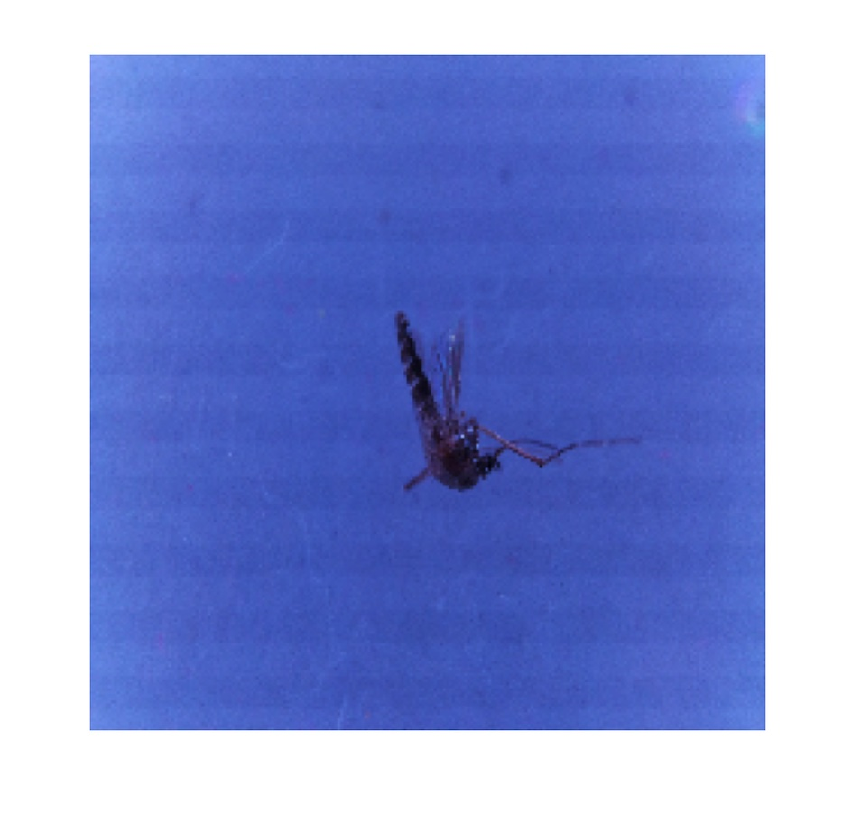
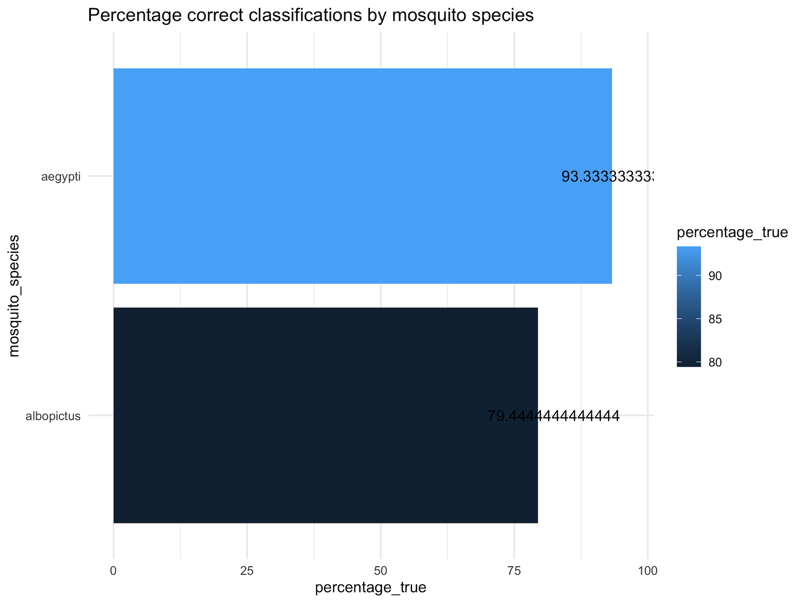

## Week 7 Assignment – Deep Learning  
**Author:** Randy Sprouse  
**Date:** 12/15/2024  

We use a dataset of mosquito images to train a deep learning model that distinguishes between two species. This task connects both ecological and public health domains. Mosquitos are known vectors for diseases like West Nile Virus and Eastern Equine Encephalitis. Currently, species identification is done manually. Automating this process can help scale disease surveillance efforts.

**Data Source:**  
[Kaggle – Aedes Mosquitos](https://www.kaggle.com/datasets/pradeepisawasan/aedes-mosquitos)

---

### Setup

The project uses the following R packages:

```r
library(tidyverse)
library(keras)
library(tensorflow)
library(reticulate)
```

Python environment (via `reticulate`) is configured to use TensorFlow 2.15.1 and Keras 2.15.0.

---

### Model Architecture

We use transfer learning with the Xception model (pretrained on ImageNet), adding global average pooling, a dense layer, dropout, and a softmax output.

---

### Training Results

After training for 6 epochs on 963 images and validating on 240, the final test accuracy was:

```
Test Accuracy: 86.39%
```

Example model performance plot and input image:

  


---

### Hyperparameter Tuning

We tested combinations of:
- Learning rate: `0.001`, `0.0001`
- Dropout: `0.2`, `0.3`
- Dense layer size: `256`, `1024`

The best result was achieved with:

- Learning Rate: `0.001`
- Dropout: `0.3`
- Dense Units: `256`
- Max Validation Accuracy: `79.02%`
